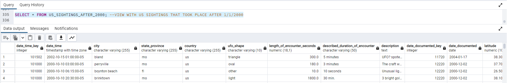

# Amanda Hanway - Databases for Analytics, Module 7
- Project: Create a SQL database and query the data  
- Date: 10/2/22

## Overview:  
This project was created as a final assignment for a master's course at NWMSU, Databases for Analytics.  

### Requirements  
- Create a database  
- Your database must include at least three tables
- One table must have at least 1,000 rows, and two other tables must have at least 100 rows
- There must be at least one date data type, one numeric data type, and one string data type

### SQL Database Procedure    
- [View SQL Code](/Module-7-Final-Project.sql)
- Overview:
    1. Create a new database named nuforc  
    2. Create a table in the nuforc database called Ufo_Sighting_Data and insert the raw data from UFO_Sighting_Data.csv     
    3. Clean the UFO data and insert it into a new table  
        - Create a new table called Ufo_Sightings to hold the cleaned dataset  
        - Select the raw data from Ufo_Sighting_Data table  
        - Create new column date_time_key  
        - Create new column date_documented_key  
        - Remove special and non-numeric characters from the latitude and longitude columns  
    4. Create a calendar table in the nuforc database called dim_date and insert the data from Calendar.csv  
    5. Create a cities table in the nuforc database called dim_cities and insert the data from US_Cities_Top_1K.csv  
        - Update column state_code using a case statement  
    6. Create a view in the nuforc database called US_Sightings_After_2000 to extract sightings in the US on or after 1/1/2000  
    7. Create a temporary table in the nuforc database called US_Sightings_by_City that joins the latitude and longitude to the UFO data  

### Data Files
- [UFO_Sighting_Data](files/ufo_sighting_data.csv)
- [Dim_Date](files/calendar.csv)
- [Dim_Cities](files/us-cities-top-1k.csv)

### Data Sources
- UFO Sighting Dataset: [kaggle](https://www.kaggle.com/datasets/camnugent/ufo-sightings-around-the-world)  
- Dates Dataset: [data.world](https://data.world/cegomez22/dimdate) 
- Cities Dataset: [github](https://raw.githubusercontent.com/plotly/datasets/master/us-cities-top-1k.csv)  

## Screenshots:

### Database: NUFORC

### Table: UFO_Sighting_Data

### Table: UFO_sightings (cleaned)

### Table: Dim_cities

### Table: Dim_date

### View: US_Sightings_After_2000

### Temporary Table: US_Sightings_by_City

### Query: Count of Rows

### Query: Aggregated by Shape and Weekday

### Query: Aggregated by City Population

